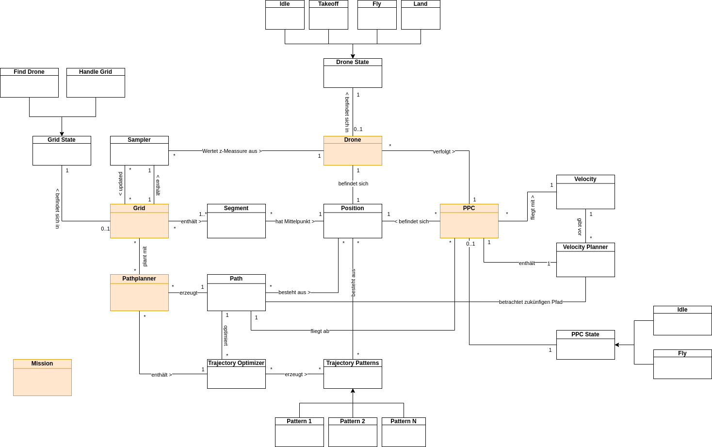

# Crazy Fly Stack

## Starting
```
ros2 launch cf_launch cf_launch.launch.py input_grid_path:=/home/maximilian/Git/cf_stack/grids/arena.json

ros2 launch tha_example tha_framework.launch.py type:=2 backend:=webots id:=0
```

## Models
### Domain Model


### Path Patterns


### State Chart


### Node Graph
